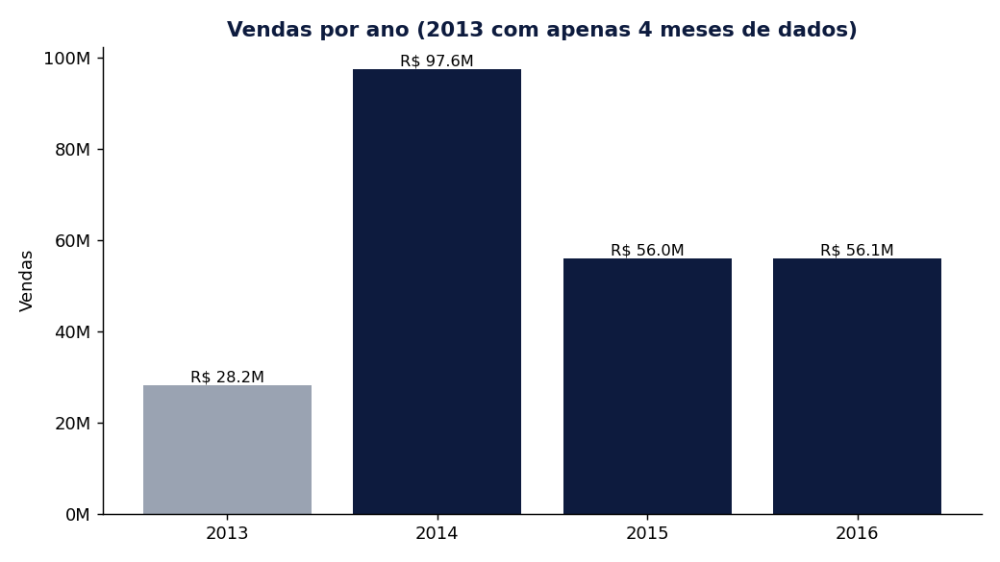
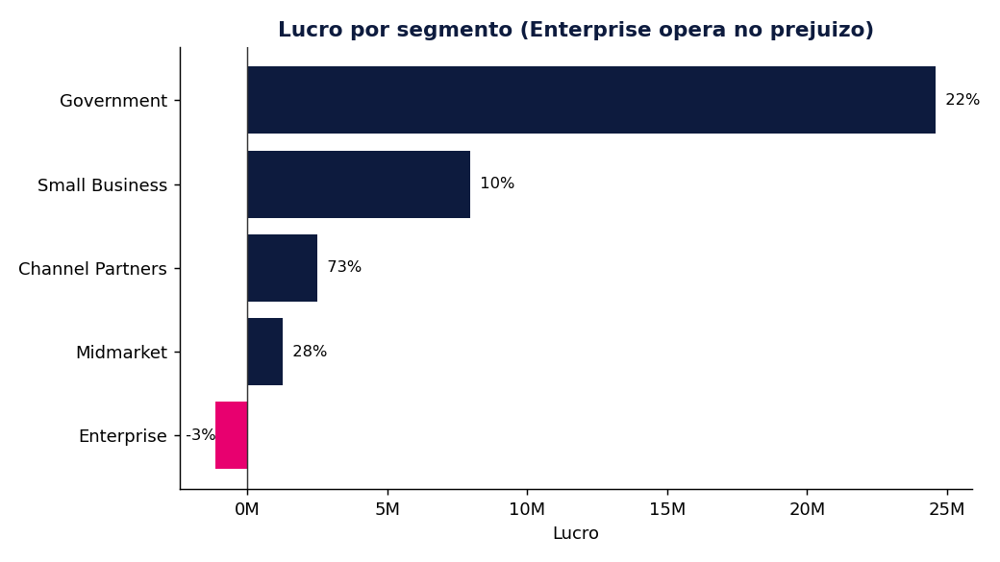
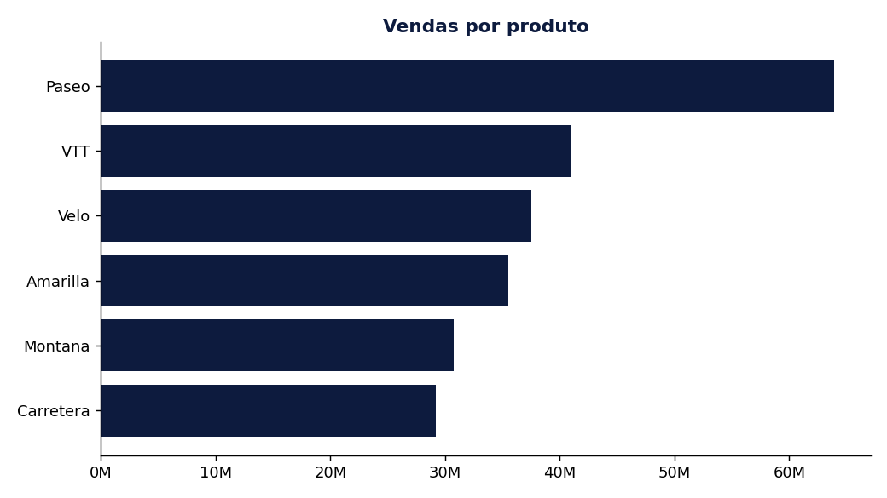

# Análise de Performance de Vendas de Bicicletas (2013 a 2016)

Projeto de análise de dados sobre a performance comercial de uma empresa que vende bicicletas em vários países, com o objetivo de transformar os dados de vendas em decisão.

O trabalho cobre o ciclo completo de uma análise: entender o problema, tratar e organizar os dados, modelar, calcular indicadores e chegar em recomendações de negócio. A mesma lógica está disponível de três formas neste repositório: o dashboard em Power BI, uma reprodução em Python e uma reprodução em SQL.

## O problema de negócio

A área comercial precisa de duas visões:

- Uma visão mensal e anual para reuniões com a liderança, focada em prioridades e estratégia comercial.
- Uma visão semanal por cliente, segmento e produto, para o time de vendas montar ações ao longo da semana.

Em resumo, a pergunta a responder é: onde estão os melhores resultados, onde a empresa está perdendo dinheiro e o que fazer com isso.

## Arquivos do repositório

- `README.md`: este documento.
- `etl_e_analise.py`: reprodução do ETL e da análise em Python (pandas).
- `analise_vendas.sql`: a mesma lógica de transformação e análise em SQL (dialeto PostgreSQL).
- `dashboard_vendas_bicicletas.pbix`: o dashboard em Power BI.
- `relatorio_analise.docx`: o relatório detalhado da análise.
- `apresentacao.pptx`: a apresentação dos resultados.
- `Base_de_dados_2013_2014_-_Sales.xlsx`, `Base_de_dados_2015_2016_-_Sales.xlsx`, `Base_de_dados_2013_2014_-_Manufacturing.xlsx`, `Base_de_dados_2015_2016_-_Manufacturing.xlsx`: os dados de origem.
- `vendas_tratadas.csv`, `fabricacao_tratada.csv`: as bases já limpas e consolidadas.
- `vendas_por_ano.png`, `lucro_por_segmento.png`, `vendas_por_produto.png`: os gráficos usados neste README.

## Os dados

Foram fornecidos quatro arquivos Excel, dois de vendas e dois de fabricação, cada par cobrindo um período diferente:

| Arquivo | Período | Linhas |
|---|---|---|
| Sales 2013_2014 | 2013 a 2014 | 715 |
| Sales 2015_2016 | 2015 a 2016 | 658 |
| Manufacturing 2013_2014 | 2013 a 2014 | 715 |
| Manufacturing 2015_2016 | 2015 a 2016 | 658 |

Depois do tratamento e da união, restaram duas bases de 1.373 linhas cada, cobrindo de setembro de 2013 a dezembro de 2016.

## Decisões técnicas e o porquê de cada uma

Antes de qualquer gráfico, os dados precisaram ser organizados. Cada decisão abaixo resolve um problema concreto.

**Separar país e produto.** Nos arquivos de 2013 e 2014, país e produto vinham juntos numa única coluna, com valores como `Germany,Carretera`. A coluna foi dividida pela vírgula em duas. Sem isso, não dá para filtrar nem comparar país e produto de forma independente.

**Converter a data.** A coluna de data estava como texto. Foi convertida para tipo data, o que é pré-requisito para filtrar por mês, trimestre ou ano e para qualquer cálculo de crescimento ao longo do tempo.

**Corrigir erros de digitação.** Ao revisar os valores únicos, apareceram categorias duplicadas por erro de escrita. Cada uma foi padronizada para o nome correto:

| Valor errado | Valor correto |
|---|---|
| Chanel Partners | Channel Partners |
| Enter&rise / Enterrise | Enterprise |
| Governmemt | Government |
| Smal Business | Small Business |
| FrancE | France |

Sem essa correção, o mesmo segmento aparece dividido em duas barras no gráfico, e os totais ficam errados.

**Unir os períodos.** As duas tabelas de vendas viraram uma só, e o mesmo para fabricação. O objetivo é ter uma fonte única de verdade em vez de dados espalhados por arquivo.

**Modelo em estrela (Star Schema).** Uma tabela de calendário foi criada como eixo central de tempo, ligada às tabelas de vendas e de fabricação pela data. Assim, qualquer filtro de período aplicado no dashboard afeta todos os gráficos ao mesmo tempo.

**Indicadores como medidas.** Total de vendas, lucro, margem, custo de fabricação e crescimento ano a ano foram calculados como medidas, que se recalculam conforme o filtro muda, em vez de colunas fixas.

## Principais achados

Os números abaixo vêm da base tratada e podem ser reproduzidos rodando o script Python ou as queries SQL.

**Visão geral do período**

- Vendas totais: R$ 237,96 milhões
- Lucro total: R$ 35,16 milhões
- Margem de lucro: 14,8%

**A queda de 2015 é a história central**



De 2014 para 2015 as vendas caíram 42,6%, de R$ 97,6 milhões para R$ 56,0 milhões. Em 2016 o patamar ficou praticamente estável em relação a 2015 (variação de +0,1%), ou seja, não houve recuperação, e sim estagnação no novo nível mais baixo.

Uma observação importante de leitura dos dados: o ano de 2013 tem apenas 4 meses de registros (de setembro a dezembro), então ele não deve ser comparado de igual para igual com os anos completos. Por isso a comparação de tendência se concentra em 2014, 2015 e 2016.

**Enterprise opera no prejuízo**



Este é o achado que mais muda a estratégia. O segmento Enterprise é o terceiro maior em vendas (R$ 38,0 milhões), mas opera com margem negativa de 3%, gerando prejuízo de R$ 1,13 milhão. Ou seja, vende bastante e ainda assim perde dinheiro.

No outro extremo, Channel Partners vende pouco (R$ 3,4 milhões), mas é o segmento mais eficiente de todos, com 73% de margem. Cada venda ali é altamente lucrativa, o que sugere espaço para crescer volume.

O Government sustenta o negócio: responde por 70% de todo o lucro com 44% das unidades, mantendo margem saudável de 22%.

| Segmento | Vendas | Lucro | Margem | % do lucro |
|---|---:|---:|---:|---:|
| Government | R$ 112,1 mi | R$ 24,6 mi | 22% | 70% |
| Small Business | R$ 80,0 mi | R$ 8,0 mi | 10% | 23% |
| Channel Partners | R$ 3,4 mi | R$ 2,5 mi | 73% | 7% |
| Midmarket | R$ 4,5 mi | R$ 1,2 mi | 28% | 4% |
| Enterprise | R$ 38,0 mi | -R$ 1,1 mi | -3% | -3% |

**Produtos e países**



Paseo é o produto mais vendido com folga (R$ 63,9 milhões), enquanto Carretera é o menos vendido (R$ 29,2 milhões). Entre os países, a disputa é equilibrada: Alemanha lidera (R$ 51,6 milhões), seguida de perto por Canadá, Estados Unidos e França, com o México na lanterna (R$ 39,4 milhões).

## Recomendações

- Investigar com prioridade a margem negativa do Enterprise. Ele vende muito e perde dinheiro, então o problema provavelmente está em precificação ou em custo, não em volume.
- Manter o Government como prioridade comercial, já que sustenta a maior parte do lucro com margem saudável.
- Estudar formas de crescer o volume de Channel Partners, que é pouco explorado mas extremamente rentável por venda.
- Entender a fundo a queda de 42,6% em 2015 e por que 2016 não recuperou. Vale olhar preço, concorrência e mudanças de mercado no período.
- Garantir disponibilidade e visibilidade do Paseo, o carro-chefe, e avaliar o futuro do Carretera no portfólio.

## Como reproduzir a análise

**Em Python**

```bash
pip install pandas openpyxl matplotlib
python etl_e_analise.py
```

O script lê os arquivos de dados que estão na mesma pasta, gera as bases tratadas em CSV, imprime os indicadores no terminal e salva os gráficos como PNG.

**Em SQL**

O arquivo `analise_vendas.sql` cria as tabelas de origem, faz a limpeza e a união, monta a tabela de calendário e traz as queries de análise que reproduzem as medidas do dashboard. Foi escrito em dialeto PostgreSQL e validado contra os mesmos resultados do Python.

## Ferramentas utilizadas

Power BI e Power Query para o dashboard e o tratamento original. Python com pandas e matplotlib para a reprodução e os gráficos. SQL (PostgreSQL) para a versão em consultas. DAX para as medidas do modelo.

## Sobre o projeto

Projeto de análise de dados com foco em mostrar não só a operação da ferramenta, mas o raciocínio por trás de cada etapa: do entendimento do problema até a recomendação de negócio.

Autora: Danielli Meilene Coutinho Arçari
